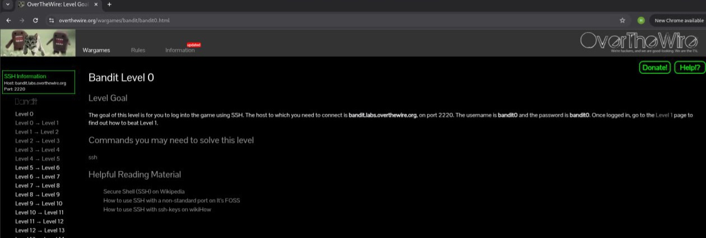
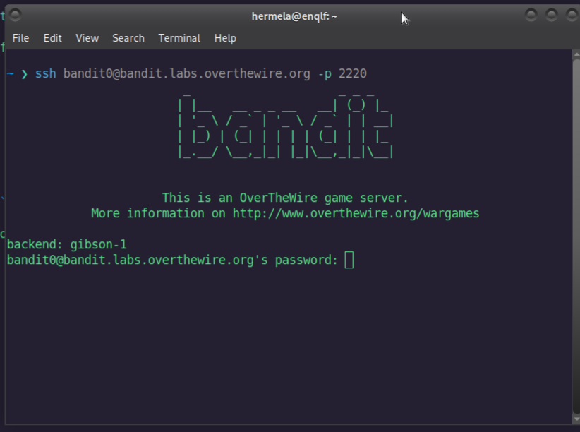

# Bandit Level 0  Write-Up

Welcome to the write-up for **Bandit Level 0**.  
In this level, the task is very simple: **log in to the remote server using SSH** and locate the password for Level 1.

The challenge page provides all the connection information, as shown in the screenshot:


- **Host:** `bandit.labs.overthewire.org`
- **Port:** `2220`
- **Username:** `bandit0`
- **Password:** `bandit0`

The command we use to connect is
 ```bash
ssh bandit0@bandit.labs.overthewire.org -p 2220 ```
  
After running the command, the terminal prompts for a password and you will enter **bandit0**, that's it!


