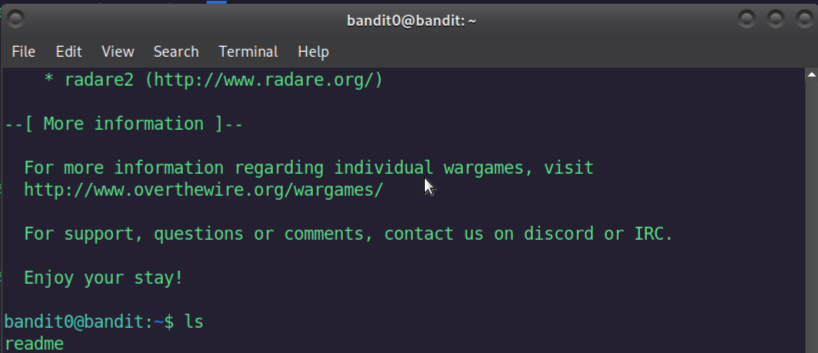
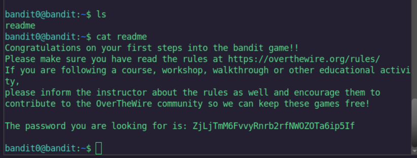

# Bandit Level 0 → 1 Write-Up

Welcome to the write-up for **Bandit Level 0**.  
In this level, our main goal is to find the password that allows us to enter the next level.

We already know from the hint that the password is stored in a file named **`readme`**.  
So first, I used the `ls` command to check if the file is actually there:

```bash
ls
```


And yes, the file readme appears in the directory.

Next, I used the cat command, which is used to display the contents of a file:
```bash
cat readme
```
This prints the content of the file, and that’s how we find the password for Level 1.


