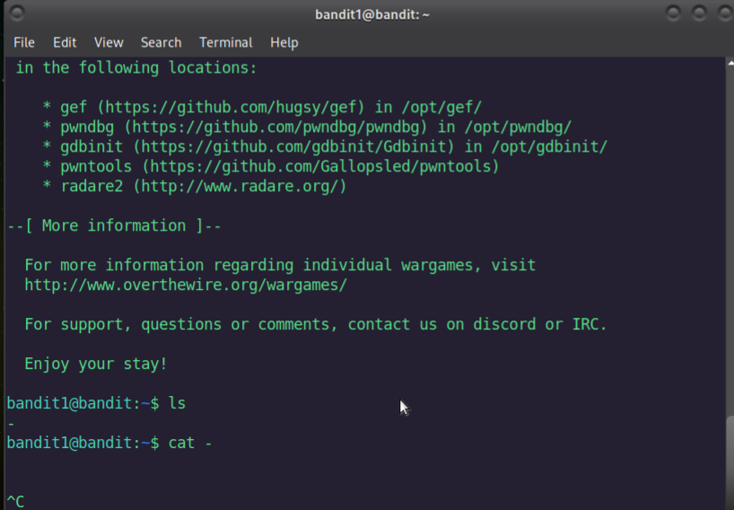

# Bandit Level 1 → 2 Write-Up

After entering the password from the previous level, we now have access to **Bandit Level 1**.  
Our goal in this level is to find the password that allows us to move to **Level 2**.

The hint tells us that the password is stored in a file named **`-`** located in the home directory.

To verify this, I first listed the files in the directory:

```bash
ls
```
Because the file name is just a single hyphen, running a normal command like:
```bash
cat -
```
does not work.



This is because **`-`** is normally interpreted by Linux as stdin, not as a filename.

To access a file with a special or confusing name, we need to specify the relative path explicitly.

So instead, I used:

```bash
cat ./-
```
Using ./ tells the shell “treat this as a file in the current directory,” not as an option or special symbol.

This displays the file’s content, which contains the password for Level 2.


<details>
<summary>Click here to see the password</summary>
263JGJPfgU6LtdEvgfWU1XP5yac29mFx
</detail>


