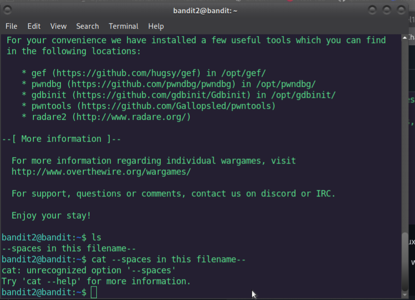

# Bandit Level 2 → 3 Write-Up

After entering the password from Level 2, we now have access to **Bandit Level 2**.  
The goal is to find the password for **Level 3**.

According to the hint, the password is stored in a file with spaces in its filename.  
Because of the spaces, we cannot simply run:

```bash
cat --spaces in this filename--
```
First, we list the files in the directory:
```bash
ls
```


When a filename contains spaces, we have two options:
- **Escape the spaces with backslashes:**
```bash
cat ./--spaces\ in\ this\ filename--

```
- **Use quotes around the full path:**

```bash
cat "./--spaces in this filename--"
```
In this case, we also use ./ **`WHY`** because the filename starts with --, similar to the previous level where - required ./ to avoid confusion with command options.

This command displays the contents of the file, revealing the password for Level 3.


<details>
<summary> Click here to see the password </summary>
MNk8KNH3Usiio41PRUEoDFPqfxLPlSmx
</details>
